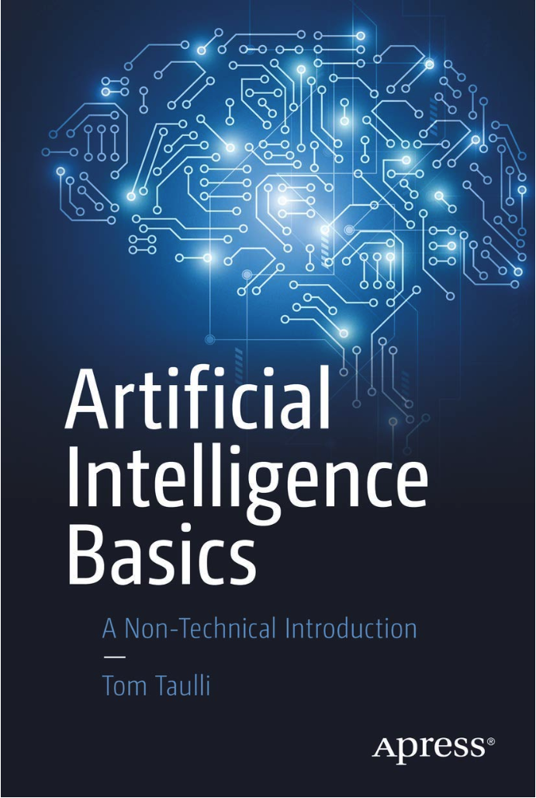

# CINF 135: Concepts of Artificial Intelligence (3 Credits)

**Semester:** Fall 2026 (Aug 24 – Dec 7, 2026)  
**Day/Time:** Online  
**Location:** Online  

**Instructor:** M. Abdullah Canbaz, Ph.D. *[ he/him/his ]*  
**Contact:** (518) 442 – 5258  
**Office Location and Hours:** Online on Tuesdays 12:00 pm – 1:00 pm or by appointment  

***Microsoft Teams Link:*** Please see Brightspace Course for the link

---

## Course Description:

An introduction to the technical foundations of artificial intelligence as well as its relevance to, and implications for modern society. The course will cover the basics of artificial intelligence and machine learning (AI/ML). This will include hands-on work. The importance of data selection, handling, etc. will also be covered. In addition, as AI/ML becomes more prevalent, it has tremendous implications in the world. The course will introduce issues of fairness, bias, explainability, etc., and how these and other issues must be addressed in the design, deployment, and use of AI/ML systems.

---

## Expected Student Learning Outcomes:

The primary objectives of this course are to help students understand:

- How modern AI/ML systems function, including their strengths and limitations.
- The relevance of AI/ML systems to society, affecting both their design and their impact.

The course prioritizes active learning, which is especially important in the rapidly evolving field of AI/ML, where knowledge and techniques can quickly become outdated. The focus will be on learning how to navigate the technical and social aspects of AI/ML rather than memorization of static information.

Upon successful completion of this course, students will be able to:

1. **Identify and define** key components of AI/ML systems. **(1.1 B)**  
   - **Measure:** Students will list and describe the essential parts of AI/ML systems.  
   - **Corresponding Assignment:** In Class Teamwork - Intro to AI Systems

2. **Research and gather** relevant information about AI/ML. **(1.2 I)**  
   - **Measure:** Students will compile and present information from various sources related to AI/ML.  
   - **Corresponding Assignment:** A1 - Data Types and Collection Mechanisms in AI

3. **Understand and explain** the different types of AI/ML systems, e.g., supervised and unsupervised learning. **(C1.1 B)**  
   - **Measure:** Students will differentiate between types of AI/ML systems and provide specific examples.  
   - **Corresponding Assignment:** A2 - Types of Machine Learning and their Applications

4. **Recognize** the strengths and limitations of AI/ML systems. **(1.3 I)**  
   - **Measure:** Students will analyze and discuss the pros and cons of different AI/ML systems.  
   - **Corresponding Assignment:** A3 - Evaluating Deep Learning Models

5. **Learn and explain** the importance of data in AI/ML, including data gathering, cleaning, and visualization. **(C1.2 I)**  
   - **Measure:** Students will demonstrate data collection, cleaning, and visualization techniques.  
   - **Corresponding Assignment:** Lab 2 - Data Collection and Initial Exploration (Hands On Code Review)

6. **Identify** legal issues related to computing. **(4.1 B)**  
   - **Measure:** Students will identify potential biases and ethical concerns in AI/ML systems and suggest mitigation strategies.  
   - **Corresponding Assignment:** In Class Teamwork - AI Ethics and Bias Detectives

7. **Reflect** on the societal impact of AI/ML technologies. **(4.4 A)**  
   - **Measure:** Students will write or present reflections on how AI/ML affects society.  
   - **Corresponding Assignment:** In-Class Activity - DL Ethical Dilemmas and Case Study Analysis

8. **Effectively communicate** technical information through writing and presentations. **(3.2 I)**  
   - **Measure:** Students will produce well written reports and deliver oral presentations on AI/ML topics.  
   - **Corresponding Assignment:** Showcase Participation and Presentation

9. **Collaborate** effectively in team settings. **(5.1 B)**  
   - **Measure:** Teamwork and collaboration will be assessed through peer evaluations, instructor observations during group activities, and a reflective self-assessment detailing individual contributions and group dynamics.  
   - **Corresponding Assignment:** Lab 5 - Advanced Applications and Project

By achieving these outcomes, students will gain foundational knowledge of the challenges and potential of AI/ML systems to prepare for further study or careers in the field.

---

## General Education: Mathematics & Quantitative Reasoning

CINF 135: Concepts of Artificial Intelligence fulfills the Mathematics and Quantitative Reasoning General Education category. The General Education Program as a whole has the following characteristics:

- General education offers explicit understandings of the procedures and practices of disciplines and interdisciplinary fields.
- General education provides multiple perspectives on the subject matter, reflecting the intellectual and cultural diversity within and beyond the University.
- General education emphasizes active learning in an engaged environment that enables students to become producers as well as consumers of knowledge.
- General education promotes critical thinking about the assumptions, goals, and methods of various fields of academic study, and the interpretive, analytic and evaluative competencies central to intellectual development.

This course satisfies the Mathematics and Quantitative Reasoning General Education requirement by engaging students in data collection, analysis, visualization, and interpretation within the context of artificial intelligence and machine learning. Students develop quantitative reasoning skills by evaluating data, interpreting graphical and numerical information, and applying logical and evidence-based approaches to understanding and assessing AI systems.

### Learning Objectives for General Education Mathematics & Quantitative Reasoning Courses

In this course, students will demonstrate mathematical skills and quantitative reasoning, including the ability to:

- decipher, interpret, and draw conclusions from formal mathematical models such as formulas, graphs, tables, or schematics;
- represent mathematical information symbolically, visually, numerically, or verbally as appropriate to mathematical, statistical, or logical analysis;
- the ability to employ appropriate mathematical computations, statistical techniques, or logical methods to solve problems and/or draw conclusions from data.

---

## Prerequisites:

*None.*

---

## Required Readings:

The required text for this course is:

- ***Taulli, Tom, Artificial Intelligence Basics: A Non-technical Introduction.*** 2019. Apress. ISBN-13: 978-1-4842-5028-0.

In addition to the required text, there will be readings that will be available to the students online or via Brightspace. When these readings are assigned, the class will be told where they can be found. These will cover the various topics in the course and will be drawn from the literature in several fields (e.g. computer science, electrical and computer engineering, psychology, informatics, law) to help inform us about the multiple perspectives necessary to understand Artificial Intelligence. This will also provide the underlying information to help us learn to critically evaluate and navigate our own digital lives securely in this rapidly changing world.

---

## Google AI Essentials Certificate

As part of this course, you will earn the **Google AI Essentials** Certificate through Coursera. Upon successful completion of the corresponding Google modules and all assignments associated to the modules, you will be eligible to claim your “Google AI Essentials” certificate.

### How It Works

1. **Access & Onboarding (Week 1):**
   - Following the link on the Brightspace module will create your account.

2. **Module Completion & Assignments:**
   - Each Google module aligns with our course topics (marked in the tentative schedule in this syllabus). You are responsible for completing the video lectures, readings, quizzes, and hands-on exercises on Coursera.

3. **Tracking Your Progress:**
   - Coursera will automatically record your module completion and quiz scores.

4. **Certificate Issuance:**
   - Once you have completed **all five Google AI Essentials modules** and the corresponding course assignments, Coursera will generate your certificate.

5. **Completion Grade:**
   - Upon completion of **all five Google AI Essentials modules** and the corresponding course assignments, your CINF 135 grades will be populated and reflected in your final grade.

Please note that successful completion of **both** the Coursera modules **and** our in-class assignments is required to earn your certificate. It’s students’ responsibility to seek help with ITS immediately if they encounter any access issues to the Coursera Modules.

---

## Grading:

| **Category**              | **Assignment Type**            | **Category Weight in the Course** | **Weight to the Final Grade** |
|---------------------------|--------------------------------|-----------------------------------|-------------------------------|
| **Individual Grades**     |                                | 35%                               |                               |
|                           | Quizzes                        |                                   | 20%                           |
|                           | Individual Assignments         |                                   | 15%                           |
| **Team Grades**           |                                | 30%                               |                               |
|                           | VoiceThread Exercises          |                                   | 30%                           |
| **Class Participation**   |                                | 20%                               |                               |
|                           | Google Certificate Assignments |                                   | 20%                           |
| **Showcase Presentation** |                                | 15%                               | 15%                           |

The above formula is the definitive grading scheme. Any “Total,” “Weighted Total,” etc. given by Brightspace does not reflect the actual grading scheme and should be ignored.

Grades are assigned based upon the percentage of points achieved by the student in the course, as weighted per the above table. The overall course **will not** be curved, although the professor retains the right curve individual assignments if the grade distribution is extreme enough to unfairly weight the overall course against the students.

This course is A-E graded and the grades are determined based on graded assignments. Your final grade will be based on a scale of 100 points:

| **A**  | **A-** | **B+** | **B** | **B-** | **C+** | **C** | **C-** | **D+** | **D** | **D-** | **E** |
|--------|--------|--------|-------|--------|--------|-------|--------|--------|-------|--------|-------|
| 100-94 | 93-89  | 88-85  | 84-82 | 81-79  | 78-76  | 75-73 | 72-70  | 69-67  | 66-64 | 63-60  | 59-0  |

---

## Fully Online Learning/Course:

This course is offered in a fully online learning format. The instructor will be available on Tuesdays/Thursdays between 12:00pm and 1:00pm via Microsoft Teams and by appointment. Students will complete class work and assignments independently using the Brightspace learning management platform. If they are not familiar with Brightspace, they may please visit the Brightspace help pages for students:
https://wiki.albany.edu/display/public/askit/Brightspace+Resources+for+Students.

---

## Course Outline:

**Important:** This tentative schedule is subject to change. Please pay attention to your Brightspace course outline and announcements.

| **Week** | **Date** | **Module**                            | **Google AI Essentials Certificate**          | **Topics**                                                    | **Notes** |
|----------|----------|---------------------------------------|-----------------------------------------------|---------------------------------------------------------------|-----------|
| 1        | 24-Aug   | M1: AI Foundations                    |                                               | Introduction, What is AI?                                     |           |
|          |          |                                       |                                               | A brief history of AI, Different types of AI                  |           |
| 2        | 31-Aug   |                                       |                                               | The potential of AI                                           |           |
|          |          |                                       |                                               | The potential of AI                                           | Quiz 1    |
| 3        | 7-Sep    | M2: Data                              |                                               | The importance of data in AI                                  |           |
|          |          |                                       |                                               | Different types of data                                       |           |
| 4        | 14-Sep   |                                       |                                               | Collecting and preparing data for AI                          |           |
|          |          |                                       |                                               | Data ethics and privacy                                       |           |
| 5        | 21-Sep   | M3: Machine Learning                  | Module 1: Introduction to AI                  | What is machine learning?                                     | Quiz 2    |
|          |          |                                       | Module 1: Introduction to AI                  | Different types of machine learning                           |           |
| 6        | 28-Sep   |                                       |                                               | Common machine learning algorithms                            |           |
|          |          |                                       |                                               | Evaluating machine learning models                            |           |
| 7        | 5-Oct    | M4: Deep Learning                     |                                               | What is deep learning?                                        | Quiz 3    |
|          |          |                                       |                                               | Neural networks                                               |           |
| 8        | ***12-13 Oct*** | ***Fall Break, No Class***     |                                               |                                                               |           |
|          | 14-Oct   |                                       |                                               | Convolutional neural networks, Recurrent neural networks      |           |
| 9        | 19-Oct   |                                       |                                               | Training and evaluating deep learning models                  | Quiz 4    |
|          |          | M5: Robotic Process Automation (RPA)  | Module 2: Maximize Productivity With AI Tools | What is RPA?, The benefits of RPA                             |           |
| 10       | 26-Oct   |                                       | Module 2: Maximize Productivity With AI Tools | How to implement RPA, RPA use cases                           |           |
|          |          | M6: Physical Robots                   |                                               | What are physical robots?, Different types of physical robots |           |
| 11       | 2-Nov    |                                       |                                               | Programming physical robots, Physical robot applications      | Quiz 5    |
|          |          | M7: Natural Language Processing (NLP) | Module 3: Discover the Art of Prompting       | What is NLP?, Common NLP tasks                                |           |
| 12       | 9-Nov    |                                       | Module 3: Discover the Art of Prompting       | NLP algorithms                                                |           |
|          |          |                                       |                                               | NLP use cases                                                 | Quiz 6    |
| 13       | 16-Nov   | M8: Implementation of AI              | Module 4: Use AI Responsibly                  | Developing and deploying AI solutions                         |           |
|          |          |                                       | Module 4: Use AI Responsibly                  | AI project management                                         |           |
| 14       | 23-Nov   |                                       | Module 5: Stay Ahead of the AI Curve          | AI governance                                                 | Quiz 7    |
|          | ***26-Nov*** | ***Thanksgiving Break, No Class*** |                                               |                                                               |           |
| 15       | 30-Nov   | M9: The Future of AI                  | Module 5: Stay Ahead of the AI Curve          | Emerging trends in AI, The ethical implications of AI         |           |
|          | 7-Dec    | ***Showcase VoiceThread Day, All Students are expected to participate the Showcase*** |       |                                                               | Quiz 8    |

---

## Policies:

**Attendance Policy:** This is an in-person course, and therefore there
are specified class sessions where attendance will be taken. Course
progression will be measured by completion of the required assignments
and exams, and there are grade given for participation or attendance.

**Missed Exams and Assignments:** Students missing an examination or
exercise due to illness or personal/family emergencies will be excused
**provided** that you notify the professor via email on the day of the
absence or earlier that the absence meets university policies on excused
absences ([see the
link](https://www.albany.edu/undergraduate_bulletin/regulations.html)),
and that **required documentation** is submitted to the professor at the
next class session. Any assignments missed due to a documented and
approved absence will need to be made up within one week of the absence,
and it is the student’s responsibility to coordinate with the professor
to make up the assignment within that time period.

**Absence due to religious observance:** New York State Education Law
(Section 224-a) - Campuses are required to excuse, without penalty,
individual students absent because of religious beliefs, and to provide
equivalent opportunities for make-up examinations, study, or work
requirements missed because of such absences. You will be required to
notify the professor **at least three days prior** to the religious
observance that you will not be able to complete the assignment, and
then an alternative date or accommodation will be made.

**Disability Policy:** Reasonable accommodations will be provided for
students with documented physical, sensory, systemic, medical,
cognitive, learning and mental health (psychiatric) disabilities. If you
believe you have a disability requiring accommodation in this class,
please notify [Disability Access and Inclusion Student
Services](mailto:Disability%20Access%20and%20Inclusion%20Student%20Services)
(518- 442-5501; daiss@albany.edu). Upon verification and after the
registration process is complete, the DAISS will provide you with a
letter that informs the course instructor that you are a student with a
disability registered with the DAISS and list the recommended reasonable
accommodations. You can review the [Equity and Compliance
website](https://www.albany.edu/equity-compliance) as well for
additional information.

**Extra Credit: Extra credit can be earned in a number of ways. All require consultation with the instructor before they are commenced. All extra-credit opportunities are capped at no more than 3 points (3%) of your overall grade.**

- *Community:* CEHC sponsors several events throughout the semester. Any
  student who attends one or more of those events may receive extra
  credit. Details about specific qualifying events will be made
  available in advance.

- Other extra credit opportunities may be available. Details to follow.

**Withdrawal from the Course:** The drop date for the Fall 2026
semester is Friday, September 4th, 2026, for undergraduate students. That is
the last date you can drop a course and not receive a 'W'. It is your
responsibility to take action by this date if you wish to drop the
course. In particular, grades of "incomplete" will not be awarded to
students because they missed the drop deadline.

**Incomplete Grade Policy (amended effective Fall 2020 and will apply to
all undergraduate Incompletes issued Fall 2020 and thereafter):**

I: Incomplete. A grade of I is a temporary grade assigned at the
discretion of the instructor when a student has been unable to complete
a class for reasons which are considered to be extenuating and beyond
the student's control. These reasons must be documented at the time of
the request. Incomplete grades do not count toward graduation.

Undergraduate students taking graduate level classes will be subject to
the Graduate Incomplete Policy for the graduate class.

Incomplete grades should ONLY be assigned:

1.  When a student makes a direct request to the instructor;

2.  The student's work to date is passing;

3.  An illness or other extenuating circumstance prevents completion of
    required work by the due date;

4.  Required work may reasonably be completed in an agreed-upon period
    (not to exceed the maximum allowable time for the completion of work
    as stated in the Timeline for Incomplete Grades), and does not
    require the student to retake any portion of the class.

If all of the above four criteria are not met, the student should be
graded according to the work completed for the class, even if this means
recording a failing grade.

Students and instructors should be mindful that making up work can be
extremely difficult given the workload of a new semester.

Incomplete grades should NOT be assigned:

- To students who do not make a direct request to the instructor

- As a substitute for a failing grade

- Where the student's performance to date clearly indicates an inability
  to complete the class as defined in the original syllabus

- If the student did not attend or stopped attending

- As a means of allowing a student to raise their grade by completing
  additional work not assigned to other students

- If re-enrollment is required for successful completion of the class

**Timeline for Incomplete Grades**

The maximum allowable time for the completion of work related to an
Incomplete is:

- Fall and Winter: convert to failing grades in April of the following
  Spring semester – dates and deadlines to be communicated by the
  Registrar’s office

- Spring and Summer: convert to failing grades in November of the
  following Fall semester – dates and deadlines to be communicated by
  the Registrar’s office

Dates and deadlines will be listed on the Academic Calendar and
communicated by the Registrar’s Office.

Instructors may require that work be completed in advance of the
deadline.

Questions about incomplete grades should be addressed to the instructor.
If an incomplete grade is agreed upon, the instructor is responsible for
entering the incomplete grade in the grade roster during final grading,
as well as changing the grade to a final grade by the incomplete grade
deadline. See Guidelines for Instructors for more information on
entering and changing grades. If an instructor is no longer available,
the chair of the department or dean of the school/college, in which the
class was offered, is authorized to supervise completion of the work and
to submit the appropriate grade change request.

Any grade of I existing after the stated deadline shall be automatically
changed to E or U according to whether or not the student is enrolled
for A–E or S/U grading. Except for extenuating circumstances approved by
the Office of the Vice Provost for Undergraduate Education, these
converted grades may not be later changed.

(NOTE: Students receiving financial assistance through state awards
should refer to Academic Criteria for State Awards in the expenses and
financial aid section of this bulletin before requesting grades of I.)

*Important:* Incompletes will not be given to students who have not
fulfilled their classwork obligations, and who, at the end of the
semester, are looking to avoid failing the course. This is asking for
special treatment.

**Academic Integrity: It is every student’s responsibility to become familiar with the standards of academic integrity at the University. Claims of ignorance, of unintentional error, or of academic or personal pressures are not sufficient reasons for violations of academic integrity. See <http://www.albany.edu/undergraduate_bulletin/regulations.html>**

Coursework and examinations are considered individual exercises. Copying
the work of others is a violation of university rules on academic
integrity.  Individual coursework is also key to your being prepared and
performing well on tests and exams. Forming study groups and discussing
assignments and techniques in general terms is encouraged, but the final
work must be your own work. **For example, two or more people may not
create an assignment together and submit it for credit. Credit will not
be given for identical final project reports with different color
palettes unless it is a group project identified by the instructor.** If you have
specific questions about this or any other policy, please ask.

The following is a list of the types of behaviors that are defined as
examples of academic dishonesty and are therefore unacceptable. Attempts
to commit such acts also fall under the term academic dishonesty and are
subject to penalty. No set of guidelines can, of course, define all
possible types or degrees of academic dishonesty; thus, the following
descriptions should be understood as examples of infractions rather than
an exhaustive list.

- Plagiarism

- Allowing other students to see or copy your assignments or exams

- Examining or copying another student’s assignments or exams

- Lying to the professor about issues of academic integrity

- Submitting the same work for multiple assignments/classes without
  prior consent from the instructor(s)

- Getting answers or help from people, or other sources (*e.g.* research
  papers, web sites) without acknowledging them.

- Forgery

- Sabotage

- Unauthorized Collaboration (just check first!)

- Falsification

- Bribery

- Theft, Damage, or Misuse of Library or Computer Resources

*Any* incident of academic dishonesty in this course, no matter how
"minor" will result in

- No credit for the affected assignment.

- A written report will be sent to the appropriate University
  authorities (*e.g.* the Dean of Undergraduate Studies)

- One of -

  - A final mark reduction by *at* *least* one-half letter grade (*e.g.*
    B → B-, C- → D+),

  - A Failing mark (E) in the course, and referral of the matter to the
    University Judicial System for disposition.

**Copyright Policy:** Materials provided to you as part of this course
are provided under Fair Use and the TEACH Act. These materials are
provided for your educational use only and should not be shared,
reposted, or further distributed. In addition, all materials and
documents developed for this course are copyright protected and may not
be reproduced or distributed without express written permission.
Finally, you must follow appropriate citation practices for materials
you reference in your work for this course. If you have questions,
please ask.

**Responsible Use of Information Technology:**
<https://wiki.albany.edu/display/public/askit/Responsible+Use+of+Information+Technology+Policy>

**Style Manual and Guidelines**: Written assignments should be
word-processed and double-spaced. Students are required to cite sources,
if any are used in their written work, according to the American
Psychological Association (APA).  

 

American Psychological Association. *2020. Publication manual of the
American Psychological Association*, 7th Edition. Washington, DC:
American Psychological Association. 

Style manuals are available in the reference sections of many mainstream
bookstores and reference sections of all 3 of the University Libraries.
(BF 76.7 P83 2020) 

[Purdue
OWL](https://owl.purdue.edu/owl/research_and_citation/apa_style/apa_formatting_and_style_guide/general_format.html) provides
guidance the construction of citations in APA style. It is based on the
7th edition of the Publication manual of the American Psychological
Association. Individuals in the social science disciplines primarily use
this style
guide. <https://owl.purdue.edu/owl/research_and_citation/apa_style/apa_formatting_and_style_guide/reference_list_books.html> 

**Time Management: For every credit hour that a course meets, students should expect to work 3 additional hours outside of class every week (3 x 3= 9). For a three-credit course, you should expect to work 9 hours outside of class every week. Manage your time effectively to complete readings, assignments, and projects.**

**Instructor Availability**: The instructor will be available for
student consultation during office hours, by appointment, and online in
Brightspace. Students are expected to check Brightspace messages
(internal) at least once every day to see whether the instructor is
trying to reach them. Students should not assume that instructor is
online 24 hours a day, 7 days a week, to answer your questions
immediately (even though the instructor will try to do so as much as
possible).

**Courtesy** In class (online) discussions the instructor and students
are expected to demonstrate professional behavior. This means
cooperating and interacting in a courteous, supportive, and tactful
manner based on mutual respect for each other's ideas.

**Students and professor should be professional at all time. Faculty
should be addressed as Prof. XXX or Dr. XXX. Emails should be addressed
“Dear…” and end with a “Thank you.” *Disrespect in any form in any CEHC
class will not be tolerated.***

**Respect for Diversity:** It is my intent that students from all
diverse backgrounds and perspectives be well served by this course, that
students’ learning needs be addressed both in and out of class, and that
the diversity that students bring to this class be viewed as a resource,
strength and benefit. It is my intent to present materials and
activities that are respectful of diversity: gender, sexuality,
disability, age, socioeconomic status, ethnicity, race, and culture.
Your suggestions are encouraged and appreciated. Please let me know ways
to improve the effectiveness of the course for you personally or for
other students or student groups. In addition, if any of our class
meetings conflict with your religious events, please let me know so that
we can make arrangements for you.[^1]

[^1]: Respect for Diversity statement from
    <https://www.brown.edu/sheridan/teaching-learning-resources/inclusive-teaching/statements>
